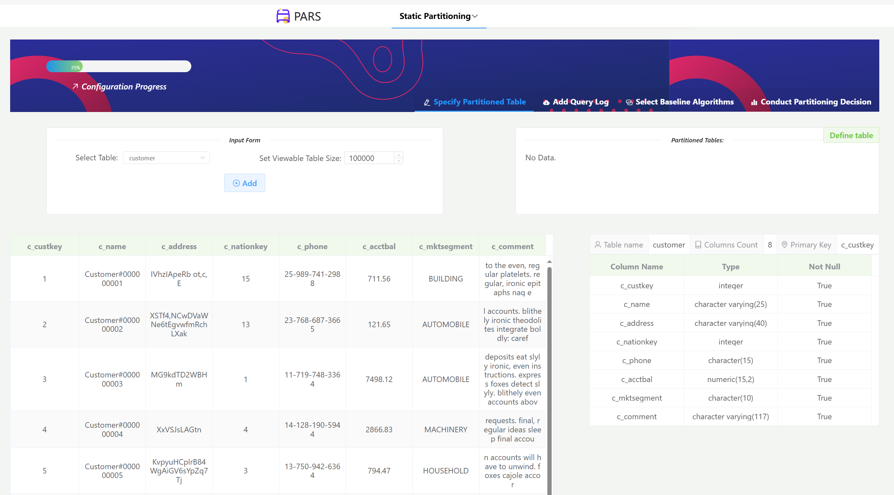
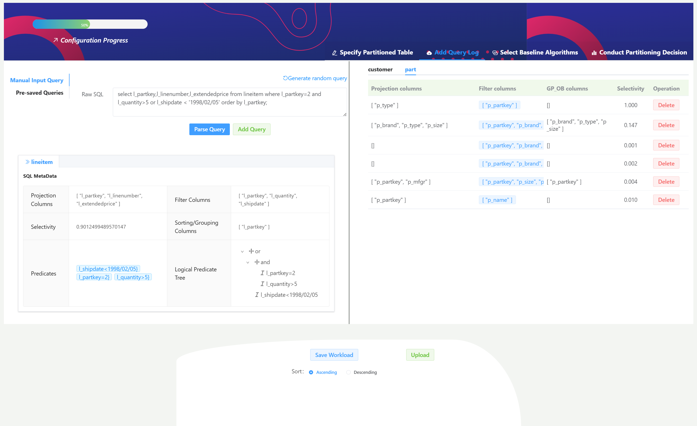
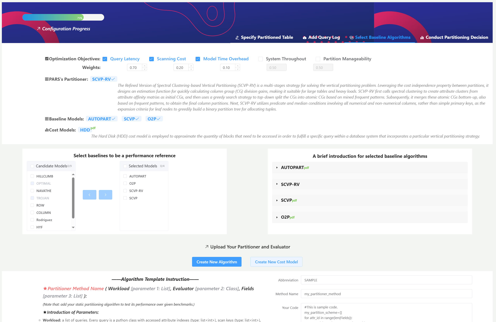
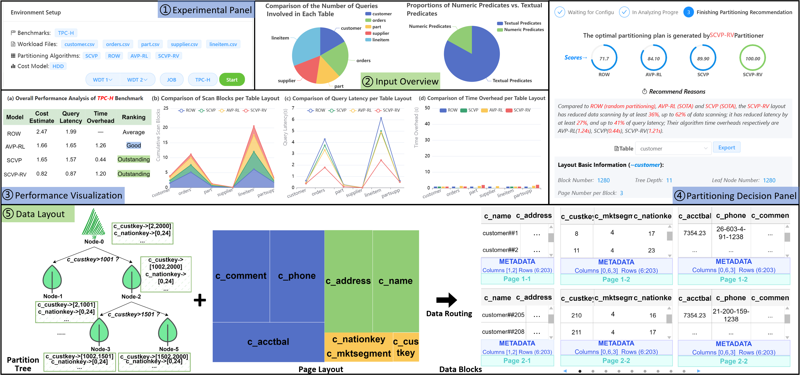

# PARS: A Decision Support System for Developing Vertical Partitioning Plans


PARS is a partitioning system for assisting database
administrators (DBAs) in identifying the optimal vertical partitioning (VP) plan. It addresses scenarios where DBAs encounter challenges in selecting an appropriate partition scheme for given specific environment, particularly for the variability in storage devices, evaluation metrics, and database schemas. Currently, there are no systems that provide automatic partitioning decisions. PARS is designed to tackle
these challenges by offering customizable experimental configu-
rations and by making informed partitioning plans based on pre-
defined optimization objectives. PARS also employs a variety of chart types to visualize the entire partitioning process.DiscoverPath is developed by [DW&BI Lab](https://cs.rice.edu/~xh37/) at Renmin University of China.

:mega: We have released our paper and demo video to help readers better understand the PARS system.

* Demo Video: [https://youtu.be/uuQZo08CDwg](https://youtu.be/uuQZo08CDwg)
* Demo System: [http://10.77.110.171](http://3.141.127.228)
* Do you want to learn more about data partitioning? Please check out our [database partitioning survey](https://jcst.ict.ac.cn/en/article/doi/10.1007/s11390-024-3538-1) and [AIDB paper resources](https://github.com/LumingSun/ML4DB-paper-list)!

## How PARS works?
Given a basic DB configuration such as table schema and workload as input, PARS initializes the  [PostgreSQL](https://www.postgresql.org/docs/14/index.html) database and uses a Feature Extractor to mine valuable column access patterns. A [cost model](https://www.sciencedirect.com/science/article/abs/pii/S002002551500643X), manually configured based on the storage environment before use, considers factors like index, I/O buffer, disk bandwidth, and block size. Leveraging the Cost Models and candidate Data Partitioners, PARS generates potential partitioning plans. It then interacts with the Query Executor to obtain multiple measured metrics for these plans and invokes the decision system to recommend the best one. The Partition Deployer subsequently creates scripts for deploying the selected plan. In this process, PARS ensures input validity by performing data cleaning (removing empty and duplicate tuples) and query validation (checking SQL syntax), adopts diverse chart components to visualize the partitioning process and results.

<div align=center>

</div>


## Cite This Work
If you find this project useful, you can cite this work by:

Liu Peng-Ju, et al. "Demonstrating PARS: A Decision Support System for Developing Vertical Partitioning Plans"
```bibtex
@article{liu2024pars,
  title={Demonstrating PARS: A Decision Support System for Developing Vertical Partitioning Plans},
  author={Liu, Peng-Ju and Li, Cuiping and Chen, Hong},
  journal={arXiv preprint},
  year={2024}
}
```

## Utilization and Demonstration of PARS

### Interface
The overall GUI interface of the PARS system, which consists of a frontend interaction (developed by [Vue2.js](https://v2.cn.vuejs.org/)), a backend platform (developed by [Flask2](https://flask.palletsprojects.com/en/2.3.x/)), and a relational database.

A using pipeline overview of PARS based on a client-server architecture. PARS follows a pipeline to gradually generate the optimal partition deployment script that meets the physical design requirements of DBAs.
<!-- 
<div align=center>

</div> -->


### Partitioning Environment Setup

The demonstration begins with a step-by-step environment configuration. At first, users are provided with various options to select or upload: (1) partitioned tables; (2) workloads involving different tables; (3) optimization objectives with user-defined weights and cost models; (4) baseline partitioners.

#### Step 1: Specify Partitioned Table 

<div align=center>

</div>

#### Step 2: Add Query Log

<div align=center>

</div>

#### Step 3: Select Baseline Algorithm

<div align=center>

</div>

### Partitioning Decision
 DBAs are then guided to a card panel (see ①) that manages the execution of partition generation and decision. Using created configurations (e.g., TPC-H) as input, PARS first presents an overview of the input using pie charts (see ②), detailing table access frequency, and the distribution of text columns and predicates. It then performs the partitioning in the background, creating each partitioner's data layout. Next, ③ evaluates these layouts against the load scenario based on selected optimization objectives.

PARS recommends the partitioning plan with the highest score (see ④). 

>Note. Baselines: ROW (which treats all columns as one column group and randomly horizontally splits them for block allocation); [AVP-RL](https://link.springer.com/chapter/10.1007/978-3-030-30278-8_16); [SCVP](https://www.jos.org.cn/jos/article/abstract/6496); SCVP-RV (our model). 

- The recommended reason highlights the advantages of the selected plan, specifically, the extent of improvement in certain optimization metrics compared to ROW (random partitioning). It shows that SCVP-RV achieves a $27\%$ and $41\%$ latency reduction in TPC-H compared to ROW and SCVP (SOTA), and also exhibits notable performance in other metrics (e.g., small gaps between model time overhead). PARS recommends the \verb|SCVP-RV|'s partitioning plan for each TPC-H table due to its highest score (100).

- The logical and physical partitions are illustrated in ⑤ using the TPC-H customer table as an example. This includes the step-by-step partition tree construct process (each split condition is clearly displayed), the page layout (three column groups), and detailed stored data within each block.


<div align=center>

</div>


## Developed Environment
### Install packages
```sh
-  Python 3.7
-  PostgreSQL 14
```

### Start PostgreSQL server
```sh
<HOME_PATH>sudo systemctl start postgresql
or
<HOME_PATH>/sudo service postgresql start

command> psql -U <user_name> -d postgres
```

### Initiaize Table Data and Workload
download synthetic datasets, e.g, [TPC-H](https://www.tpc.org/tpch/) benchmark

Then, load the data file (.tbl)
```txt
copy region from '~/tpch-dbgen/tbl/region.tbl' with delimiter as '|' NULL '';
copy nation from '~/tpch-dbgen/tbl/nation.tbl' with delimiter as '|' NULL '';
copy partsupp from '~/tpch-dbgen/tbl/partsupp.tbl' with delimiter as '|' NULL '';
copy customer from '~/tpch-dbgen/tbl/customer.tbl' with delimiter as '|' NULL '';
copy lineitem from '~/tpch-dbgen/tbl/lineitem.tbl' with delimiter as '|' NULL '';
copy orders from '~/tpch-dbgen/tbl/orders.tbl' with delimiter as '|' NULL '';
copy part from '~/tpch-dbgen/tbl/part.tbl' with delimiter as '|' NULL '';
copy supplier from '~/tpch-dbgen/tbl/supplier.tbl' with delimiter as '|' NULL '';
```

Next, generate the synthetic queries based on provided 22 query templates. e.g., TPC-H Q1:
```SQL
select
l_returnflag,
l_linestatus,
sum(l_quantity) as sum_qty,
sum(l_extendedprice) as sum_base_price,
sum(l_extendedprice*(1-l_discount)) as sum_disc_price,
sum(l_extendedprice*(1-l_discount)*(1+l_tax)) as sum_charge,
avg(l_quantity) as avg_qty,
avg(l_extendedprice) as avg_price,
          avg(l_discount) as avg_disc,
count(*) as count_order
from
lineitem
where
l_shipdate <= date '1998-12-01' - interval '[DELTA]' day (3)
group by
l_returnflag,
l_linestatus
order by
l_returnflag,
l_linestatus;
```

## Browsers support

Modern browsers and Internet Explorer 10+.

| [](http://godban.github.io/browsers-support-badges/)</br>IE / Edge | [](http://godban.github.io/browsers-support-badges/)</br>Firefox | [](http://godban.github.io/browsers-support-badges/)</br>Chrome | [](http://godban.github.io/browsers-support-badges/)</br>Safari |
| --------- | --------- | --------- | --------- |
| IE10, IE11, Edge| last 2 versions| last 2 versions| last 2 versions

## License

[MIT](https://github.com/PanJiaChen/vue-admin-template/blob/master/LICENSE) license.

Copyright (c) 2024-present PengJu Liu